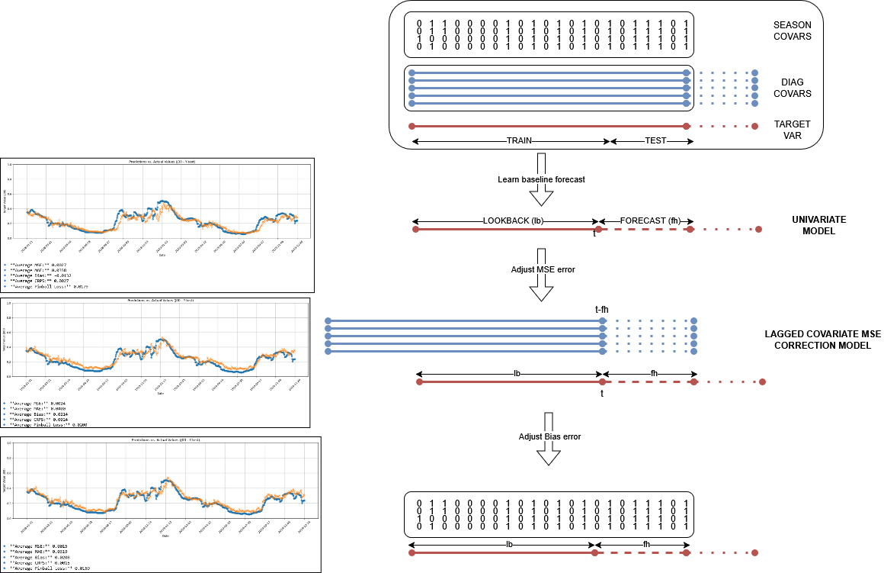

<<<<<<< HEAD
# WAIKATO_FORECAST_demand

This notebook provides a comprehensive approach to forecasting demand for health diagnostic visits using deep learning models, including vanilla Transformer, MultiheadAttention mechanisms models and Recurrent Neural Networks (RNNs) with feature selection methods.

The forecasting algorithm consists of three key phases:

- Initial Forecasting – A univariate model generates the baseline forecast.
- Residual Prediction – In subsequent phases, the forecast is refined by modeling the residuals.
- Incorporating Seasonality & Lagged Features – The final predictions integrate seasonal patterns and lagged variables that influence demand, enhancing accuracy.

This approach leverages both sequential modeling techniques and residual learning to improve forecasting performance, making it a powerful tool for time series prediction in healthcare demand.

To run the grid seach with the interesting hyperparameters, you should have:

- All libraries installed from the .yaml

- The files with name BEST_features_NONSMOOTH in excel format. These are the best features for training a model in a certain forecast, obtained from the LMLR + Gcausal pipeline

=======
# WAIKATO_FORECAST_demand

This notebook provides a comprehensive approach to forecasting demand for health diagnostic visits using deep learning models, including vanilla Transformer, MultiheadAttention mechanisms models and Recurrent Neural Networks (RNNs) with feature selection methods.

The forecasting algorithm consists of three key phases:

- Initial Forecasting – A univariate model generates the baseline forecast.
- Residual Prediction – In subsequent phases, the forecast is refined by modeling the residuals.
- Incorporating Seasonality & Lagged Features – The final predictions integrate seasonal patterns and lagged variables that influence demand, enhancing accuracy.

This approach leverages both sequential modeling techniques and residual learning to improve forecasting performance, making it a powerful tool for time series prediction in healthcare demand.

To run the grid seach with the interesting hyperparameters, you should have:

- All libraries installed from the .yaml

- The files with name BEST_features_NONSMOOTH in excel format. These are the best features for training a model in a certain forecast, obtained from the LMLR + Gcausal pipeline

>>>>>>> samper_cleaning
-Change the directory routes to get the data in the univariate config (config_univ_transformer.py) and multivariate config (config_residual_transformer.py )